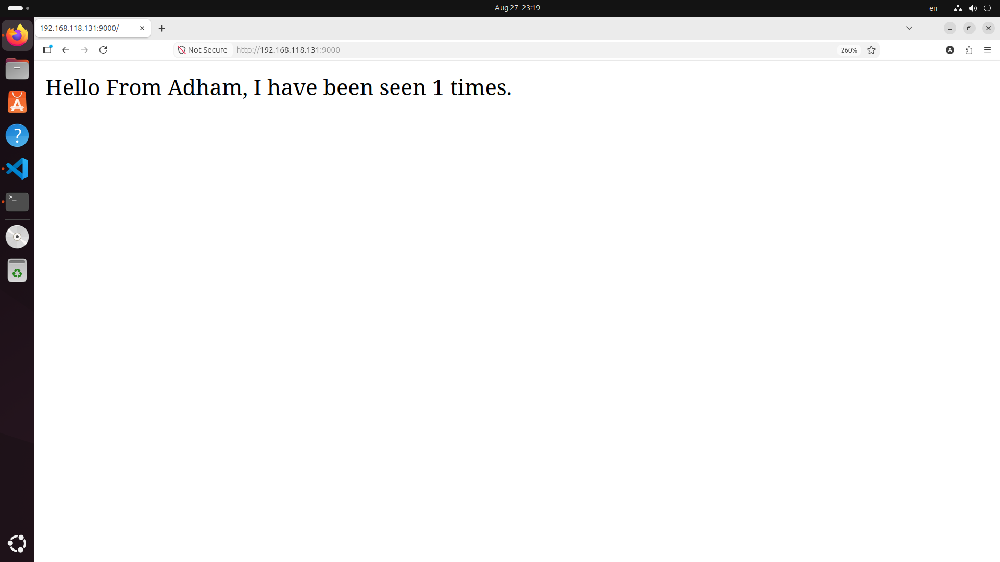

# 🐳 Flask + Redis with Docker Compose

<p align="center">
  
  
  
</p>

A practical DevOps project demonstrating how to containerize a **Flask web application**, connect it with **Redis**, and manage multiple services using **Docker Compose**.

The application includes a simple visitor counter that stores the number of requests using Redis.

---

# 📌 Project Overview

The project workflow:

```text
Flask Application
        |
        ↓
Docker Container
        |
        ↓
Redis Container
        |
        ↓
Docker Compose
        |
        ↓
Bind Mount Development
        |
        ↓
Live Code Updates
```

---

# ✨ Features

- Flask web application
- Redis integration
- Dockerized deployment
- Multi-container environment using Docker Compose
- Visitor counter using Redis
- Bind mount volume for development
- Flask debug mode for automatic reload

---

# 🛠 Technologies Used

- Python
- Flask
- Redis
- Docker
- Docker Compose
- Linux
- Git & GitHub

---

# 📁 Project Structure

```text
flask-redis-docker-compose/

├── app.py
├── requirements.txt
├── Dockerfile
├── docker-compose.yml
├── .gitignore
│
└── screenshots/
    ├── flask-dockerfile.png
    ├── python-dependencies.png
    ├── docker-compose-basic.png
    ├── docker-compose-build-success.png
    ├── docker-compose-bind-mount.png
    ├── flask-app-code-initial.png
    ├── flask-app-code-updated.png
    ├── browser-first-request.png
    ├── browser-after-change-first-request.png
    ├── browser-after-change-hit-counter.png
    ├── redis-hit-counter-demo.png
    └── running-containers.png
```

---

# 🐳 Dockerfile

The application runs inside a Python container.

```dockerfile
FROM python:3.9-slim

WORKDIR /app

COPY requirements.txt .

RUN pip install -r requirements.txt

COPY . .

CMD ["python", "app.py"]
```

<p align="center">
  
</p>

### Dockerfile Explanation

| Instruction | Description |
|---|---|
| FROM | Defines the base Python image |
| WORKDIR | Sets the application directory |
| COPY | Copies project files |
| RUN | Installs dependencies |
| CMD | Starts Flask application |

---

# 📦 Python Dependencies

The application uses:

```text
Flask
redis
```

<p align="center">
  
</p>

---

# 🔗 Docker Compose

The project contains two services:

## Flask Service

- Runs the web application
- Exposes the application port
- Communicates with Redis

## Redis Service

- Stores the visitor counter
- Uses the official Redis image

Initial Docker Compose setup:

<p align="center">
  
</p>

---

# 🚀 Run the Project

## Clone Repository

```bash
git clone https://github.com/adhamgebely/flask-redis-docker-compose.git
```

Move into the project:

```bash
cd flask-redis-docker-compose
```

---

## Build Images

```bash
docker compose build
```

---

## Start Services

```bash
docker compose up
```

Or run in background:

```bash
docker compose up -d
```

Successful build:

<p align="center">
  
</p>

---

# 🌐 Open Application

Open:

```text
http://localhost:9000
```

---

# 🔢 Redis Hit Counter

Each request increases the counter stored in Redis.

Example:

```text
Hello From Adham, welcome to you!
I have been seen 5 times.
```

<p align="center">
  
</p>

---

# 🐳 Running Containers

Check running containers:

```bash
docker ps
```

<p align="center">
  
</p>

---

# 🔄 Development Workflow with Bind Mount

During development, a bind mount was added:

```yaml
volumes:
  - .:/app
```

and Flask debug mode was enabled:

```yaml
environment:
  FLASK_DEBUG: "true"
```

<p align="center">
  
</p>

## Why Use Bind Mount?

The bind mount connects the local project directory with the container directory.

Benefits:

- Modify Python files without rebuilding the image
- Changes appear immediately inside the container
- Faster development workflow
- Easier debugging

---

# 📝 Code Update Example

## Initial Flask Code

<p align="center">
  
</p>

---

## Updated Flask Code

<p align="center">
  
</p>

---

# 🌍 Application Before and After Update

## Before Code Change

<p align="center">
  
</p>

---

## After Code Change

The application detects the code update automatically because of the bind mount and Flask debug mode.

First request after update:

<p align="center">
  
</p>

Visitor counter after multiple requests:

<p align="center">
  
</p>

---

# 📋 Useful Commands

Check containers:

```bash
docker ps
```

View logs:

```bash
docker compose logs
```

Stop services:

```bash
docker compose down
```

Rebuild:

```bash
docker compose build
```

Start in background:

```bash
docker compose up -d
```

---

# 🧹 Cleanup

Remove unused containers:

```bash
docker container prune
```

Remove unused images:

```bash
docker image prune
```

Clean Docker resources:

```bash
docker system prune
```

---

# 🎯 Learning Objectives

Through this project:

- Containerized a Flask application
- Connected Flask with Redis
- Managed multiple services using Docker Compose
- Learned Docker networking
- Used bind mounts for development
- Implemented live code updates
- Managed application lifecycle with Docker commands

---

# 👨‍💻 Author

**Adham Gebely**

GitHub:

https://github.com/adhamgebely

---

⭐ If you found this project useful, consider giving it a star.
