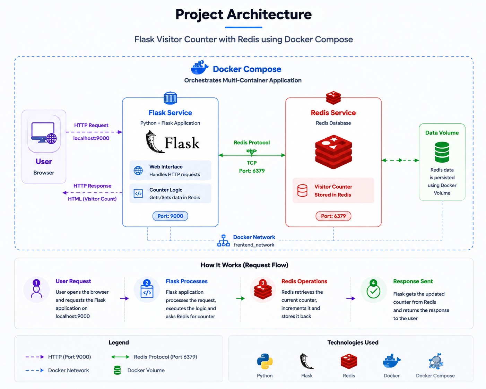

# 🚀 Flask Visitor Counter with Redis & Docker Compose

<p align="center">
  
  
  
</p>

A DevOps project demonstrating how to build, containerize, and run a Flask visitor counter application using Redis and Docker Compose.

The application uses Redis to store the visitor count and Docker Compose to manage the multi-container environment.

---

# 🏗 Architecture

<p align="center">
  
</p>

The application consists of:

- **Flask Service**
  - Handles HTTP requests
  - Runs the web application
  - Communicates with Redis

- **Redis Service**
  - Stores visitor counter data
  - Provides fast data access

- **Docker Compose**
  - Manages multiple containers
  - Creates the application network

---

# ✨ Features

- Flask web application
- Redis visitor counter
- Docker containerization
- Multi-container deployment using Docker Compose
- Development workflow using bind mount volume
- Automatic code reload with Flask debug mode

---

# 🛠 Technologies

- Python
- Flask
- Redis
- Docker
- Docker Compose
- Linux
- Git & GitHub

---

# 📁 Project Structure

```text
flask-redis-docker-compose/

├── app.py
├── requirements.txt
├── Dockerfile
├── docker-compose.yml
├── .gitignore
│
└── screenshots/
```

---

# 🐳 Dockerfile

The Flask application runs inside a Python Docker container.

```dockerfile
FROM python:3.9-slim

WORKDIR /app

COPY requirements.txt .

RUN pip install -r requirements.txt

COPY . .

CMD ["python", "app.py"]
```

<p align="center">
  
</p>

---

# 📦 Dependencies

The application uses:

```text
Flask
redis
```

<p align="center">
  
</p>

---

# 🔗 Docker Compose Setup

The project contains two services:

## Flask Service

Responsible for running the web application.

## Redis Service

Responsible for storing the visitor counter.

Initial Docker Compose configuration:

<p align="center">
  
</p>

---

# 🚀 Running the Project

## Clone Repository

```bash
git clone https://github.com/adhamgebely/flask-redis-docker-compose.git
```

```bash
cd flask-redis-docker-compose
```

---

## Build Containers

```bash
docker compose build
```

---

## Start Services

```bash
docker compose up
```

Or:

```bash
docker compose up -d
```

Successful build:

<p align="center">
  
</p>

---

# 🌐 Access Application

Open:

```text
http://localhost:9000
```

---

# 🔢 Redis Visitor Counter

Each request increases the counter stored in Redis.

<p align="center">
  
</p>

---

# 🐳 Running Containers

Check running containers:

```bash
docker ps
```

<p align="center">
  
</p>

---

# 🔄 Development Workflow with Bind Mount

During development, a bind mount volume was added:

```yaml
volumes:
  - .:/app
```

and Flask debug mode was enabled:

```yaml
environment:
  FLASK_DEBUG: "true"
```

<p align="center">
  
</p>

## Why Bind Mount?

The bind mount connects the local project directory with the container directory.

Benefits:

- Modify code without rebuilding the image
- Faster development cycle
- Automatic reload during development

---

# 📝 Code Update Example

## Initial Code

<p align="center">
  
</p>

## Updated Code

<p align="center">
  
</p>

---

# 🌍 Application Before and After Update

## Before Update

<p align="center">
  
</p>

---

## After Update

<p align="center">
  
</p>

<p align="center">
  
</p>

---

# 📋 Useful Commands

View containers:

```bash
docker ps
```

View logs:

```bash
docker compose logs
```

Stop application:

```bash
docker compose down
```

Rebuild:

```bash
docker compose build
```

---

# 🎯 Learning Outcomes

Through this project:

- Built a Flask application container
- Integrated Redis with Flask
- Managed multiple containers using Docker Compose
- Used Docker networking
- Applied bind mount development workflow
- Learned container lifecycle management

---

# 👨‍💻 Author

**Adham Gebely**

GitHub:
https://github.com/adhamgebely
