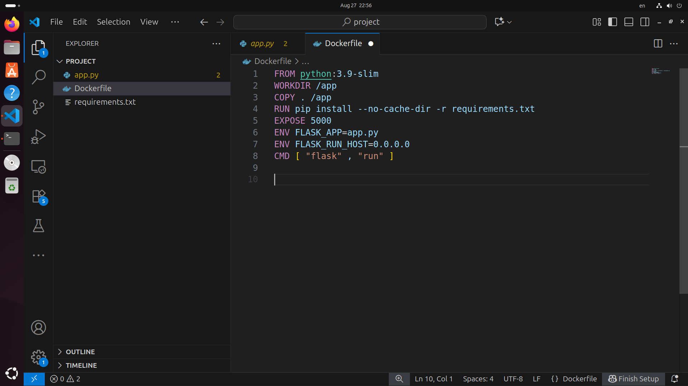
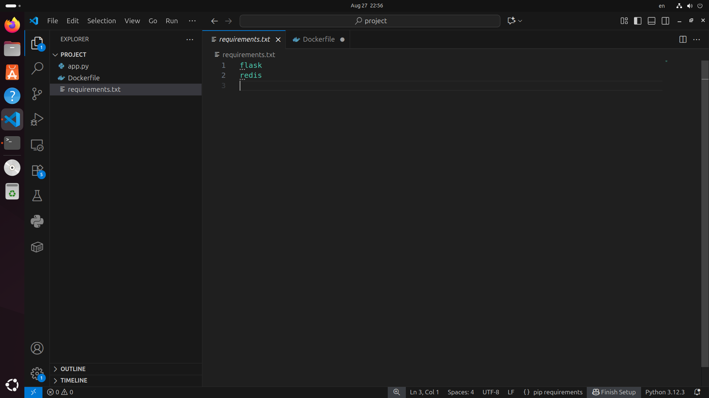
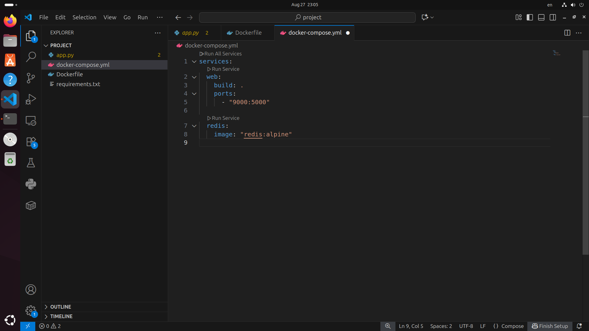
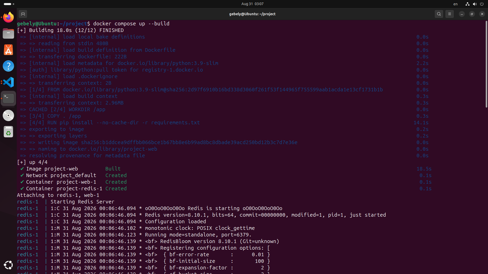
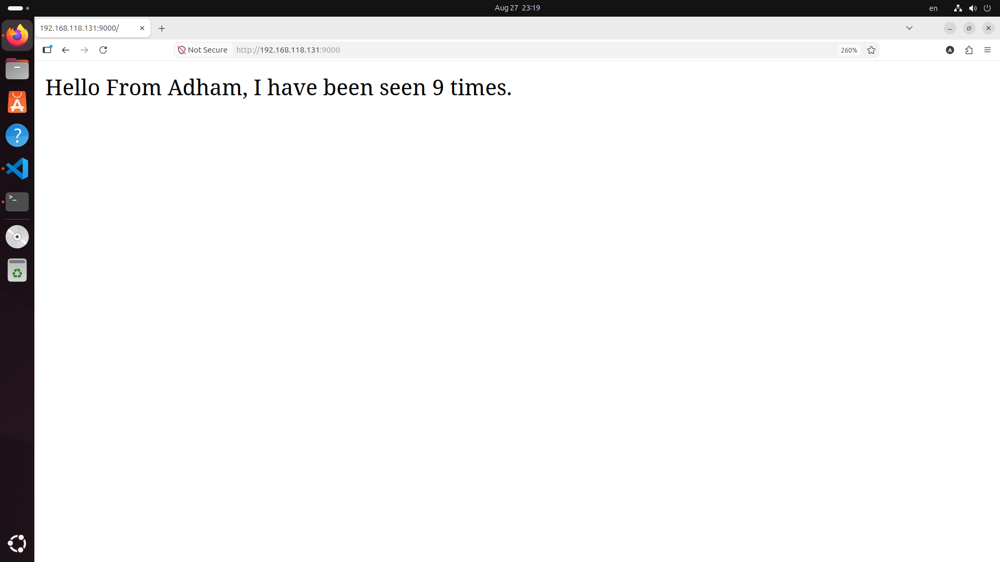
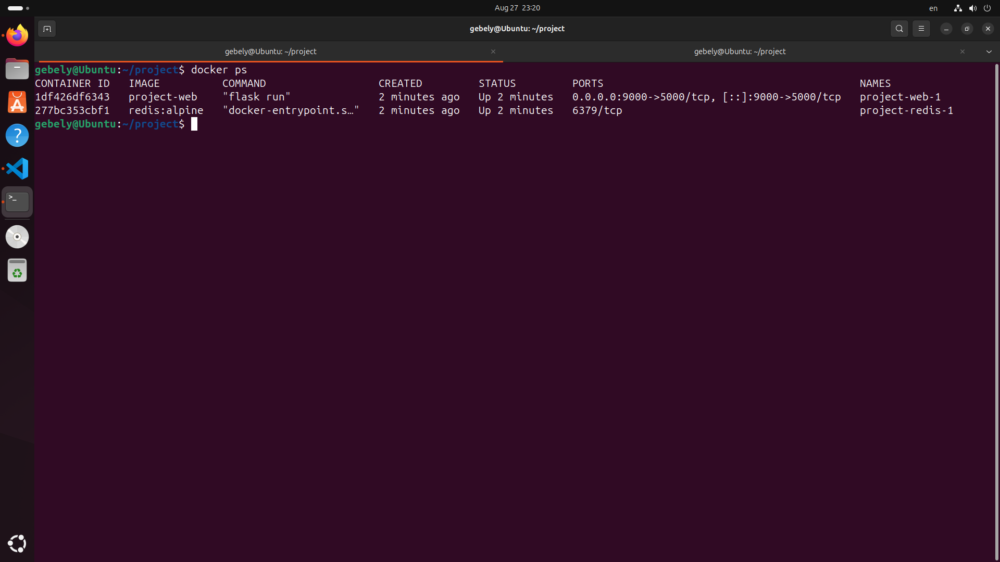
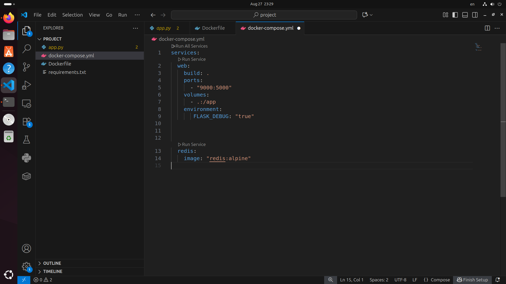
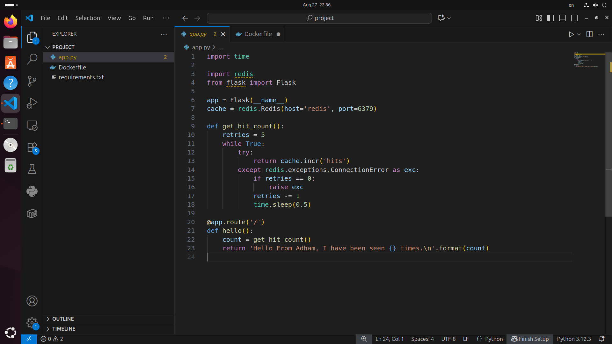
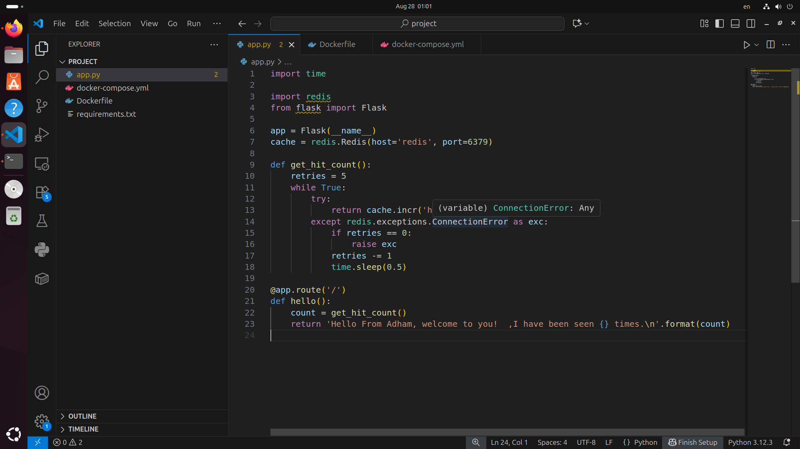
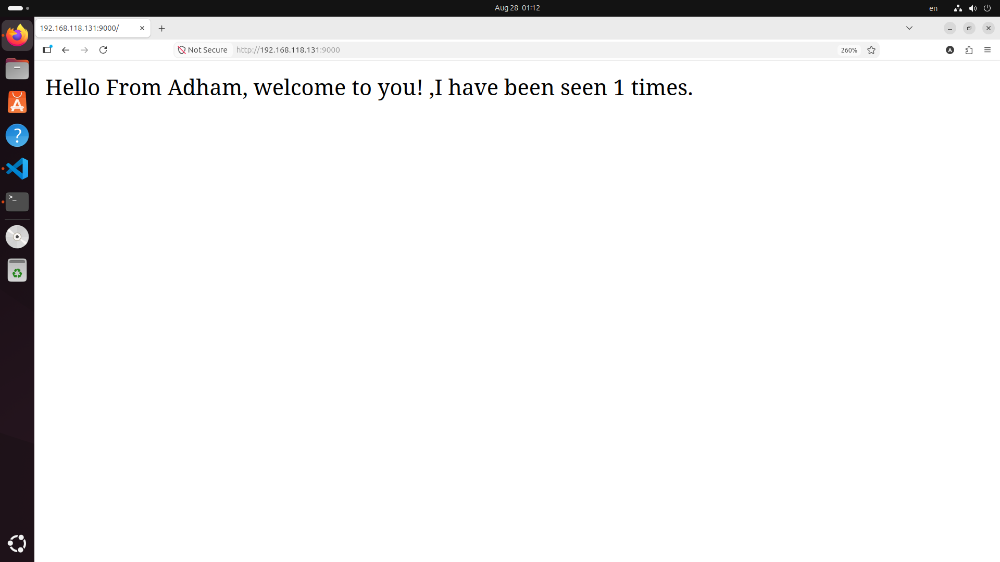

# 🐳 Flask + Redis with Docker Compose

<p align="center">
  
  
  
</p>

A practical DevOps project demonstrating how to containerize a **Flask web application**, connect it with **Redis**, and manage both services using **Docker Compose**.

The application includes a simple **visitor counter** that stores the number of visits using Redis.

---

# 📌 Project Overview

The project demonstrates the following workflow:

```text
Flask Application
        |
        ↓
Docker Container
        |
        ↓
Redis Container
        |
        ↓
Docker Compose
        |
        ↓
Development with Bind Mount Volume
        |
        ↓
Live Code Updates
```

---

# ✨ Features

- Flask web application
- Redis integration for storing visitor count
- Dockerized application
- Multi-container setup using Docker Compose
- Development workflow using bind mount volume
- Flask debug mode for automatic reload
- Persistent application changes without rebuilding the image

---

# 🛠 Technologies Used

- Python
- Flask
- Redis
- Docker
- Docker Compose
- Linux
- Git & GitHub

---

# 📁 Project Structure

```text
flask-redis-docker-compose/

├── app.py
├── requirements.txt
├── Dockerfile
├── docker-compose.yml
├── .gitignore
│
└── screenshots/
    ├── flask-dockerfile.png
    ├── python-dependencies.png
    ├── docker-compose-basic.png
    ├── docker-compose-build-success.png
    ├── docker-compose-bind-mount.png
    ├── flask-app-code-initial.png
    ├── flask-app-code-updated.png
    ├── browser-before-change-first-request.png
    ├── browser-after-change-first-request.png
    ├── browser-after-change-hit-counter.png
    ├── redis-hit-counter-demo.png
    └── running-containers.png
```

---

# 🐳 Dockerfile

The application uses a Python container to run Flask.

```dockerfile
FROM python:3.9-slim

WORKDIR /app

COPY requirements.txt .

RUN pip install -r requirements.txt

COPY . .

CMD ["python", "app.py"]
```

## Dockerfile Explanation

| Instruction | Description |
|---|---|
| `FROM` | Uses Python as the base image |
| `WORKDIR` | Sets the application directory |
| `COPY` | Copies project files into the container |
| `RUN` | Installs Python dependencies |
| `CMD` | Starts the Flask application |

<p align="center">
  
</p>

---

# 📦 Python Dependencies

The application requirements:

```text
Flask
redis
```

<p align="center">
  
</p>

---

# 🔗 Docker Compose Setup

The project contains two services:

### Flask Service

- Runs the web application
- Exposes port `9000`
- Connects to Redis

### Redis Service

- Stores the visitor counter
- Runs using the official Redis image

Initial setup:

<p align="center">
  
</p>

---

# 🚀 Build and Run the Project

## 1. Clone Repository

```bash
git clone https://github.com/adhamgebely/flask-redis-docker-compose.git
```

Move into the project:

```bash
cd flask-redis-docker-compose
```

---

## 2. Build Containers

```bash
docker compose build
```

---

## 3. Start Services

```bash
docker compose up
```

Or run in background:

```bash
docker compose up -d
```

Successful build:

<p align="center">
  
</p>

---

# 🌐 Access the Application

Open:

```text
http://localhost:9000
```

The application displays the visitor count stored in Redis.

---

# 🔢 Redis Hit Counter

Every request increases the counter stored inside Redis.

Example:

```text
Hello From Adham, welcome to you!
I have been seen 5 times.
```

<p align="center">
  
</p>

---

# 🐳 Running Containers

Check running containers:

```bash
docker ps
```

Example:

<p align="center">
  
</p>

---

# 🔄 Development Workflow (Bind Mount)

During development, a bind mount volume was added:

```yaml
volumes:
  - .:/app
```

and Flask debug mode was enabled:

```yaml
environment:
  FLASK_DEBUG: "true"
```

<p align="center">
  
</p>

## Why use a Bind Mount?

The bind mount connects the project folder on the host machine with the application folder inside the container.

This allows:

- Editing Python files directly on the host machine
- Seeing changes inside the container immediately
- Avoiding rebuilding the Docker image after every code modification

This creates a faster development workflow.

---

# 📝 Code Update Example

Initial Flask code:

<p align="center">
  
</p>

After modifying the Flask message:

<p align="center">
  
</p>

---

# 🌍 Application Before and After Update

## Before Code Change

<p align="center">
  
</p>

---

## After Code Change

The container automatically detects the code update because of the bind mount and Flask debug mode.

First request after update:

<p align="center">
  
</p>

Visitor counter after multiple requests:

<p align="center">
  
</p>

---

# 📋 Useful Docker Commands

## Show running containers

```bash
docker ps
```

## View logs

```bash
docker compose logs
```

## Stop services

```bash
docker compose down
```

## Rebuild containers

```bash
docker compose build
```

## Start containers in background

```bash
docker compose up -d
```

---

# 🧹 Cleanup

Remove stopped containers:

```bash
docker container prune
```

Remove unused images:

```bash
docker image prune
```

Remove unused Docker resources:

```bash
docker system prune
```

---

# 🎯 What I Learned

Through this project:

- Built a Flask application container
- Connected Flask with Redis
- Managed multiple containers using Docker Compose
- Used bind mounts for development
- Implemented live code updates
- Learned Docker networking between services
- Managed application lifecycle with Docker commands

---

# 👨‍💻 Author

**Adham Gebely**

GitHub:

https://github.com/adhamgebely

---

⭐ If you found this project useful, consider giving it a star.
